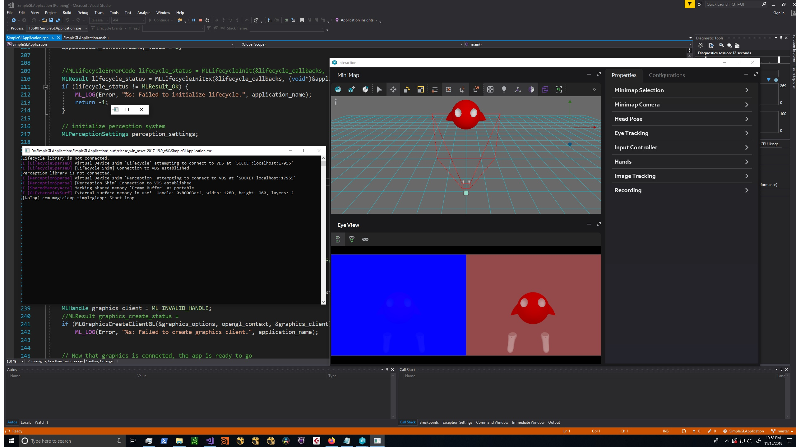

# SimpleGLApplication
Sample [MagicLeap](http://www.magicleap.com) C library Application using OpenGL externals
---

---
**Nov 15 2019**: Uploaded reworked version of MagicLeap `SimpleGlApp.mabu` project. 

`The following is a summary of an old MagicLeap sample C library application that is no longer distributed. The instructions are not entirely my own and are a mix of [MagicLeap](http://www.magicleap.com) build instructions + my own findings with Visual Studio Enterprise on a Windows 10 System.`

## Starting Out
The first thing to know is that [MagicLeap](http://www.magicleap.com) is a company that develops (not so cheap) Augmented Reality headsets. However, it is quite great technology AND you dont need to own the glasses to begin experimenting with the hardware in a virtualized way.

Ok you need to create an account on MagicLeap and download the [PackageManager](https://creator.magicleap.com/downloads/lumin-sdk/overview) which is a unified platform to download and install all components that will get you up and running to develop magileap experiences. For our purpuse you need to download and install the magic leap sdk (well documented on the site).

---
Keeping it simple, the magicleap C/C++ API allows a user to access both OS/Hardware layers through a unified API. While you can create standalone apps and such using the other tools that unity provides (unity, unreal, lumin runtime, etc), the C\C++ API can allow to really dive into the headset. 

This example is quite simple: It allows us to use OpenGl to "paint" each eye in an alternating alpha red/blue color. However we will see this through the virtual environment as the image above shows.

---
Part of your SDK installation includes a very important piece of software called the [MagicLeap Builder](https://creator.magicleap.com/learn/guides/magic-leap-builder-overview). If you have ever built a code project via a CLI (cmake, dotnet, msbuild,gcc, etc) then this is no different. If you have set up your [Environment](https://creator.magicleap.com/learn/guides/programming-guide) correctly then your IDE or "shell" should have `mabu` set up correctly and accesible through the system PATH. 

## External Dependencies
Graphics Libraries: While the SDK contains the graphics libraries necessary to develop on the device, it does not bundle these libraries for Win, OSX and Linux. So we have to download these OpenGL (most framous graphics library) libraries for our operating system of choice. (Remember that I'm using windows so I cannot speak for other systems). The following is the instructions which I followed...for windows at least...

#### Prerequisites

This project builds for the device out of the box, using the EGL APIs included in MLSDK, but since EGL is not common for desktops,
it uses alternate APIs on the host side, which you need to fetch.

You will need to install versions of these for your host:

  * glfw 3 -- (OpenGL Framework) -- [http://www.glfw.org/download.html]

     * Windows: install the 64-bit Windows binaries.
     
Take note of glfw's `include` subdirectory, which is needed for `GLFW_INCS` below, and the `lib-vc2017` subdirectory, needed for `GLFW_LIBS` below.

     * macOS: use cmake to build glfw as documented on the site.
        * Create build files with `cmake -DBUILD_SHARED_LIBS` and otherwise follow its instructions.
        * Fix up the generated `libglfw.3.dylib` via `install_name_tool -id libglfw.3.dylib .../path/to/lib/libglfw.3.dylib` (so you don't have to install it)

Take note of glfw's `include` subdirectory, called `GLFW_INCS` below, and the `lib` subdirectory, called `GLFW_LIBS` below.

  * glad -- (GL/GLES/EGL/GLX/WGL Loader-Generator) -- [http://glad.dav1d.de/]

glad is wrapper library that simplifies discovering and loading OpenGL for multiple versions of the specification
on multiple platforms. 

The URL above is a frontend for a generator for the library.

For this example, you only need to generate for GL 4.3, for the core profile in C/C++.

     *  [Generate GL 4.3 headers and loaders][http://glad.dav1d.de/#profile=core&specification=gl&api=gl%3D4.3&api=gles1%3Dnone&api=gles2%3Dnone&api=glsc2%3Dnone&language=c&loader=on]

Download `glad.zip` and extract somewhere, which we call `GLAD_ROOT` below.

Then, generate the platform-specific files:

     *  [Windows support (wgl)][http://glad.dav1d.de/#specification=wgl&api=wgl%3D1.0&extensions=WGL_3DFX_multisample&extensions=WGL_3DL_stereo_control&extensions=WGL_AMD_gpu_association&extensions=WGL_ARB_buffer_region&extensions=WGL_ARB_context_flush_control&extensions=WGL_ARB_create_context&extensions=WGL_ARB_create_context_no_error&extensions=WGL_ARB_create_context_profile&extensions=WGL_ARB_create_context_robustness&extensions=WGL_ARB_extensions_string&extensions=WGL_ARB_framebuffer_sRGB&extensions=WGL_ARB_make_current_read&extensions=WGL_ARB_multisample&extensions=WGL_ARB_pbuffer&extensions=WGL_ARB_pixel_format&extensions=WGL_ARB_pixel_format_float&extensions=WGL_ARB_render_texture&extensions=WGL_ARB_robustness_application_isolation&extensions=WGL_ARB_robustness_share_group_isolation&extensions=WGL_ATI_pixel_format_float&extensions=WGL_EXT_colorspace&extensions=WGL_EXT_create_context_es2_profile&extensions=WGL_EXT_create_context_es_profile&extensions=WGL_EXT_depth_float&extensions=WGL_EXT_display_color_table&extensions=WGL_EXT_extensions_string&extensions=WGL_EXT_framebuffer_sRGB&extensions=WGL_EXT_make_current_read&extensions=WGL_EXT_multisample&extensions=WGL_EXT_pbuffer&extensions=WGL_EXT_pixel_format&extensions=WGL_EXT_pixel_format_packed_float&extensions=WGL_EXT_swap_control&extensions=WGL_EXT_swap_control_tear&extensions=WGL_I3D_digital_video_control&extensions=WGL_I3D_gamma&extensions=WGL_I3D_genlock&extensions=WGL_I3D_image_buffer&extensions=WGL_I3D_swap_frame_lock&extensions=WGL_I3D_swap_frame_usage&extensions=WGL_NV_DX_interop&extensions=WGL_NV_DX_interop2&extensions=WGL_NV_copy_image&extensions=WGL_NV_delay_before_swap&extensions=WGL_NV_float_buffer&extensions=WGL_NV_gpu_affinity&extensions=WGL_NV_multisample_coverage&extensions=WGL_NV_present_video&extensions=WGL_NV_render_depth_texture&extensions=WGL_NV_render_texture_rectangle&extensions=WGL_NV_swap_group&extensions=WGL_NV_vertex_array_range&extensions=WGL_NV_video_capture&extensions=WGL_NV_video_output&extensions=WGL_OML_sync_control&language=c&loader=on]
     *  macOS support -- nothing extra needed
     *  [X11 support (glx)][http://glad.dav1d.de/#specification=glx&api=glx%3D1.4&language=c&loader=on]

Again download the generated `glad.zip` and extract on top of `GLAD_ROOT`.

Opening & Building
---
**BEFORE YOU OPEN THE PROJECT**
Visual Studio in this case does update the project upon changes to the `*.package` and `*.mabu` files. The Visual Studio Extension forces a recycle to check dependencies. Please open `glad.comp` and `glfw.com` and edit the contents to point to your personal directories. It seems that the Visual Studio extension has a hard time readig system variables, so it will spit errors if you dont hard code those paths. Building the project works fine when doing a `mabu -t <target>` type of build command. This is clearly a VS bug which has yet to be resolved.

---

Assuming your project loaded correctly. Opening the .cpp application for the project in VS might show Error lines (red underline). This is possibly just an intellisense error - Either F12 on the item to go to its definition and go back to the code or just rebuild - the errors should go away.

Building
---
The easiest step in visual studio to build is the typical `Ctrl+Shift+B` Build Solution key press. If all went well, then you can proceed to  the following steps: 
* Open up the virtual frontent: **..\mlsdk\v0.22.0\VirtualDevice\bin\UIFrontend\MLRemote.exe**
* Select `Start Simulator` and a virtual environment window called Interatcion should pop up.
* On the lower screen select the first of 3 menu icons. This should divide that lower screen to 2 horizontal screens. (1 for each "eye").
* Back in Visual Studio, change the project to Release mode x64 Local Windows Debugger. If all is well, then the proeject should build and run and you will see a terminal showing connections to the virtual server and the blue/red "eyes" displaying in the virtual environment application.

If you are in a non windows environment...you can explore the `mabu` commands to build and run. You can use the `mabu -t <targetArchitecture> <projectName> --invoke` command to run your project and display in the virtual application. 

Feel free to msg me with question on getting this thing working. 
